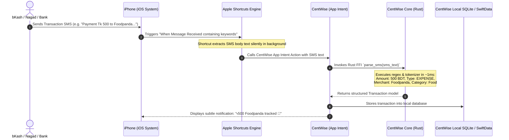

# CentWise — iOS Apple Shortcuts Automation Architecture

## 1. Overview
On iOS, Apple restricts regular third-party apps from directly reading the SMS inbox or listening to system-wide push notifications for privacy reasons.

To provide **100% automated background transaction tracking on iPhone**, CentWise utilizes **Apple Shortcuts (`Shortcuts.app`) Message Automations** paired with native **Swift App Intents** and a high-speed **Rust Parser Core (`centwise-core`)**.

---

## 2. Architecture & Data Flow



---

## 3. Core Components

### A. Swift Native Layer (`AppIntents`)
CentWise exposes an `AppIntent` to the iOS system that accepts the SMS string:

```swift
import AppIntents

struct ParseTransactionIntent: AppIntent {
    static var title: LocalizedStringResource = "Parse SMS Transaction"
    static var description = IntentDescription("Parses Bangladeshi MFS and Bank SMS in real-time.")

    @Parameter(title: "SMS Body")
    var smsBody: String

    func perform() async throws -> some IntentResult {
        // 1. Parse SMS using high-performance Rust FFI
        guard let transaction = CentWiseCore.parseSMS(text: smsBody) else {
            return .result()
        }
        
        // 2. Persist to local database
        Database.shared.insertTransaction(transaction)
        
        // 3. Post a local confirmation notification
        NotificationManager.showTrackingAlert(for: transaction)
        
        return .result()
    }
}
```

### B. Rust Engine (`centwise-core`)
- Executes in under **1 millisecond** (crucial for iOS background execution budgets).
- Matches Bangladesh MFS & Bank patterns (bKash, Nagad, Rocket, Upay, Cellfin, City Bank, BRAC Bank, etc.).
- Normalizes BDT amounts (`Tk`, `৳`), Transaction IDs, balances, and counterparties.
- Automatically categorizes merchants (e.g., *Foodpanda* $\rightarrow$ Food, *Pathao* $\rightarrow$ Transport, *Daraz* $\rightarrow$ Shopping).

### C. Apple Shortcuts Configuration (One-Time User Setup)
- **Trigger:** *Message*
  - **Sender / Message Contains:** `Tk`, `bKash`, `Nagad`, `Rocket`, `Cellfin`, `Citytouch`
- **Action:** *Run CentWise: "Parse SMS Transaction"* passing *Shortcut Input (Message Content)*
- **Execution Options:**
  - *Run Immediately:* **Enabled**
  - *Notify When Run:* **Disabled** (for silent background tracking)

---

## 4. User Onboarding Flow
1. User installs **CentWise** on iPhone.
2. CentWise presents a 1-tap onboarding guide: *"Enable iOS Auto-Tracking"*.
3. CentWise triggers an iCloud shortcut installation link or guides the user to toggle the pre-configured automation.
4. From that point forward, all bKash, Nagad, and Bank SMS messages are tracked in the background silently.
